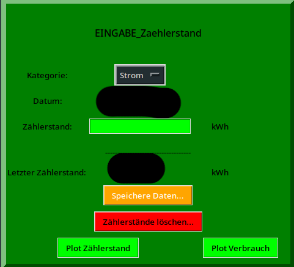

# SWaG-Tool
## Namensfindung 
**S**(trom)**Wa**(sser)**G**(as)-Tool

## Beschreibung
Eingabemöglichkeit und Übersicht über Strom-, Wasser- &amp; Gas-Zählerstande und Verbrauch per matplotlib in python

## Voraussetzungen (Requirements)
- tk (Python-Package)
- matplotlib (Python-Package)
- tkcalendar (Python-Package)

## Anleitung (Start)

1. Am besten eignet sich dafür ein virtuelles Environment in Python:\
`python3 -m venv env`

2. Virtual Environment Activation:\
`source env/bin/activate`

3. Anschließend installieren wir die benötigten Packages via pip: \
`pip install tk` \
`pip install matplotlib` \
`pip install tkcalendar`

4. Datei (GUI_meter_graph_reader.py) ausführbar:\
`python GUI_meter_graph_reader.py`

## Anleitung (Optionen)

Wenn die App erfolgreich gestartet wurde, müsste folgendes Fenster zu sehen sein: \
\

## Aktuelle Ideen/Erweiterungen

1. Keylistener: Nur Ziffern (0 - 9) und "." wird als Eingabe zugelassen. (Weil nur Datums- und *float*-Eingaben notwendig)